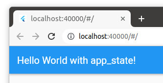
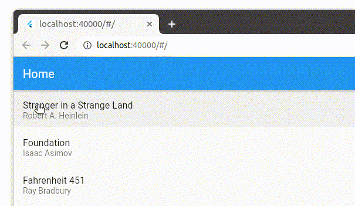
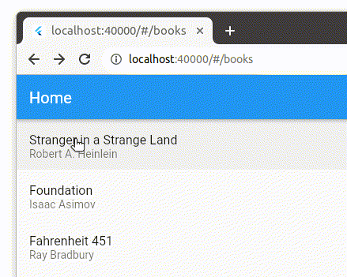
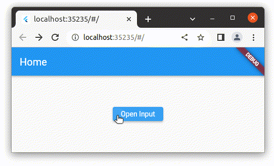

The gallery of runnable examples is here: https://github.com/alexeyinkin/flutter-app-state-examples

## 1. Bare Minimal App

This app does nothing.

Runnable project: https://github.com/alexeyinkin/flutter-app-state-examples/tree/main/app_state_1_min

## 2. The Book List App Without URLs

Runnable project: https://github.com/alexeyinkin/flutter-app-state-examples/tree/main/app_state_2_two_screens

## 3. The Book List App With URLs

Runnable project: https://github.com/alexeyinkin/flutter-app-state-examples/tree/main/app_state_3_web

## 4. Tabs with Independent Navigation Stacks

Runnable project: https://github.com/alexeyinkin/flutter-app-state-examples/tree/main/app_state_4_tabs

## 5. Receiving the Dialog Result after the App Restart

Runnable project: https://github.com/alexeyinkin/flutter-app-state-examples/tree/main/app_state_5_route_result

## 6. Recovering Unsaved Input on Back and Forward Navigation

Runnable project: https://github.com/alexeyinkin/flutter-app-state-examples/tree/main/app_state_6_forward_recovery

